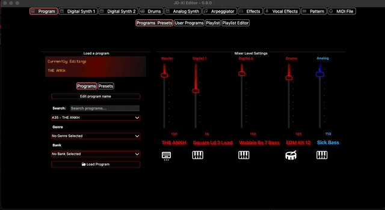
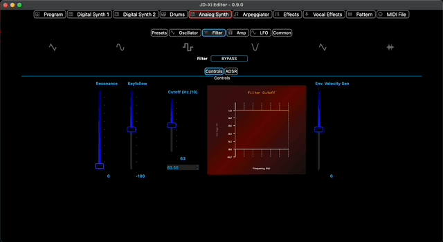
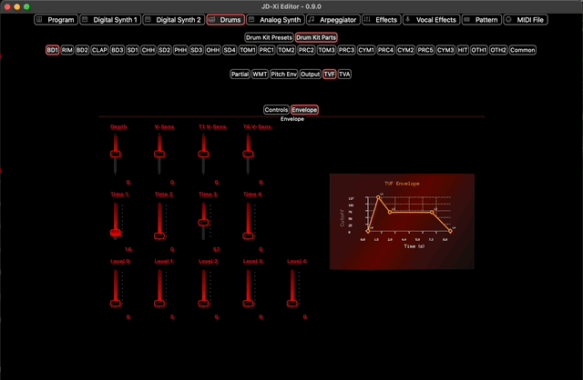
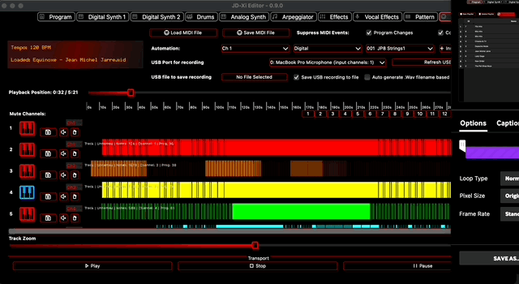
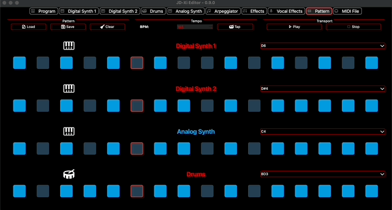

# JDXI-Editor


**JDXI-Editor**: A powerful MIDI editor for the **Roland JD-Xi synthesizer**, built with **Python**, **Qt Framework**, and **RtMidi**. Simplify MIDI editing, preset selection, and sound design without hardware menus. Perfect for musicians and sound designers!

It’s designed to implement as many features as possible from Roland’s MIDI implementation—without the need to dive through hardware menus. 🎛️

---

## 🎛️ Features of JDXI-Editor for Roland JD-Xi Synthesizer
- **On-Screen Keyboard**: Easily play and test sounds from your JD-Xi.
- **Preset Selection with Search**: Quickly find and load presets.
- **Octave Shifting**: Adjust octave ranges for precise sound control.
- **Digital & Analog Synth Editors**: Edit JD-Xi's digital and analog synths directly.
- **Drum Part Editor**: Customize drum sounds and patterns 🥁.
- **Effects Editor**: Edit reverb, delay, vocoder, and arpeggiator settings.
- **MIDI Debugger**: Monitor and debug MIDI messages efficiently.

---

Designed for musicians, sound designers, and MIDI enthusiasts looking to unlock the full potential of the Roland JD-Xi synthesizer!

### 🖥️ Current 'Keyboard Window' Screenshot

<a href="./resources/main_window_0.6.gif" rel="Current view of the Roland JD-Xi Editor App">
  
</a>

---
## 🎥 Watch JDXI-Editor in Action

Check out some great performances and demos of the Roland JD-Xi:

- 🎹 [Pink Floyd – *Sheep* 🐑 on the Roland JD-Xi](https://www.youtube.com/watch?v=vh-i8eb2SYQ)  
- 🎹 [Avicii – *Wake Me Up* on the Roland JD-Xi](https://www.youtube.com/watch?v=VyQxaOc6G2Y)  
- 🎹 [Vangelis – *Blade Runner End Titles* | Synth Cover on the Roland JD-Xi](https://www.youtube.com/watch?v=mGgGibBKm9E)  
- 🎹 [Underworld – *Born Slippy* on the Roland JD-Xi](https://www.youtube.com/watch?v=xHLttYaMxCw&list=PLVZK_NOytILiQuNulDn-tOdAUQWdNAS-y&index=18)  
- 🎹 [*Knight Rider Theme* on the Roland JD-Xi](https://www.youtube.com/watch?v=4XpuQm7_Ohs&list=PLVZK_NOytILiQuNulDn-tOdAUQWdNAS-y&index=20)  
- 🎹 [Twin Peaks – *Laura Palmer's Theme* on the Roland JD-Xi](https://www.youtube.com/watch?v=zSkKNoy8O9Y&list=PLVZK_NOytILiQuNulDn-tOdAUQWdNAS-y&index=29)  
- 🎹 [The Cure – *A Forest* on the Roland JD-Xi](https://www.youtube.com/watch?v=wejcaIawCMs&list=PLVZK_NOytILiQuNulDn-tOdAUQWdNAS-y&index=25)  
- 🎹 [Michael Jackson – *Thriller* on the Roland JD-Xi](https://www.youtube.com/watch?v=flFQlFggTug&list=PLVZK_NOytILiQuNulDn-tOdAUQWdNAS-y&index=19)  

---

### 🎬 Featured Demo  

Lady Gaga – *Telephone* performed on the Roland JD-Xi  

[](https://www.youtube.com/watch?v=PkUobEa_gyk)

## 🚀 Getting Started


### MacOS 🖥️
There is a new build for MacOS Sequoia. See the [releases page:](https://github.com/markxbrooks/JDXI-Editor/releases/tag/v0.9)

### Windows 📦
There is a new build for Windows See the [releases page:](https://github.com/markxbrooks/JDXI-Editor/releases/tag/v0.9)

### Linux 📦 

There is a new build for Linux See the See the [releases page:](https://github.com/markxbrooks/JDXI-Editor/releases/tag/v0.9)


### Python 🐍
If you're a Python programmer, you may wish to run the program from a Python environment:

```bash
$ git clone https://github.com/markxbrooks/JDXI-Editor.git
$ cd JDXI-Editor
$ python -m venv venv
$ source venv/bin/activate
$ python -m pip install -r requirements.txt
$ python -m jdxi_editor.main
```

# 📖 Documentation
Access JD-Xi documentation in the format that works best for you:

## ℹ Available Formats:
### 📃 HTML Documentation:

https://markxbrooks.github.io/JDXI-Editor/

### 📃 PDF Documentation:
[PDF Documentation](https://github.com/markxbrooks/JDXI-Editor/blob/main/doc/JD-Xi_Editor-0.8.pdf)

### 🎹 UI Previews


**Program Editor**  
<a href="./resources/program_editor.gif">
  
</a>

&nbsp;

**Analog & Digital Synths**  
<a href="./resources/analog_synth.gif">
  
</a>

&nbsp;

<a href="./resources/digital_synth.png">
  
</a>

&nbsp;

**Drum Editor**  
<a href="./resources/drum_editor.gif">
  
</a>

&nbsp;

**Midi File Player**  
<a href="./resources/midi_player.gif">
  
</a>

&nbsp;

**Pattern Sequencer**  
<a href="./resources/pattern.gif">
  
</a>

&nbsp;

**Effects and Arpeggiator**  
<a href="./resources/effects.png">
  
</a>


---

## 🎛️ Features

- On-screen Keyboard
- Preset selection with search
- Octave shifting
- JD-Xi-style LCD Display
- ADSR displays
- Pitch ENV displays
- Digital Synth Parts 1 & 2 (including 3 partials per part)
- Analog Synth Editor
- Drum Part Editor 🥁
- Effects: Reverb, Delay, Vocoder
- Arpeggiator Editor

---

## ❓ Frequently Asked Questions
### What is JDXI-Editor?
JDXI-Editor is a Python-based MIDI editor for the Roland JD-Xi synthesizer, built with the Qt Framework and RtMidi.
### Does JDXI-Editor work on MacOS, Linux and Windows?
Yes, JDXI-Editor supports MacOS, Linux, and Windows!
### What features does JDXI-Editor offer?
JDXI-Editor provides preset selection, synth editing, drum part customization, effects editing, and more.

---

- Learn more about the [Roland JD-Xi Synthesizer](https://www.roland.com/global/products/jd-xi/).
- Explore the [Qt Framework](https://www.qt.io/) for building cross-platform apps.
- Discover [RtMidi](https://www.music.mcgill.ca/~gary/rtmidi/), a real-time MIDI library.

---

### 💡 Contribute and Share Feedback
JDXI-Editor is a growing project! 
- ⭐ Star this repository to support its development.
- 🛠️ Contribute features or report issues via [GitHub Issues](https://github.com/markxbrooks/JDXI-Editor/issues).

---

## Building

```bash
python -m building.buildsys 2>&1 | head -50

Building on: linux
Project root: /home/brooks/PycharmProjects/JDXI-Editor
╭─────────── linux builder ────────────╮
│  linux builder Application Starting  │
╰──────────────────────────────────────╯
[02/10/26 23:12:10] INFO                        ℹ️ linux builder starting up with log file /home/brooks/.linux builder/logs/linux builder-10Feb2026-23-12-10.log...                                                         
                    INFO                        ℹ️ 🎹 JD-Xi Editor v0.9.5 - Linux Build System                                                                                                                              
                    INFO                        ℹ️ ==================================================                                                                                                                       
                    INFO                        ℹ️                                                                                                                                                                          
                             🧹 Cleaning previous builds...                                                                                                                                                                
                    INFO                        ℹ️                                                                                                                                                                          
                             📦 Building with PyInstaller...                                                                                                                                                               
                    INFO                        ℹ️   This may take a few minutes... 
```


## 🙏 Credits

- [Qt](https://www.qt.io/)
- [RtMidi](https://www.music.mcgill.ca/~gary/rtmidi/)
- [Cursor.ai](https://cursor.so)
- [qtawesome](https://github.com/spyder-ide/qtawesome)
- Inspiration from many great JD-Xi editor projects that paved the way
- **Roland**, for creating such a powerful little synth!

---

> Made with 🎹 and ☕ by @markxbrooks

