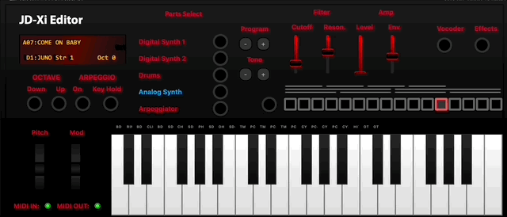
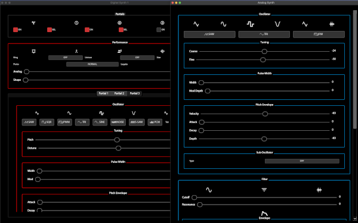

# JDXI-Editor


**JDXI-Editor** is an editor for the **Roland JD-Xi** synthesizer, written in **Python** using the **Qt Framework** and **RtMidi**.

It’s designed to implement as many features as possible from Roland’s MIDI implementation—without the need to dive through hardware menus. 🎛️

> ⚠️ This app is a work in progress and not yet feature-complete—but feel free to try it out and share your feedback!

---

### 🖥️ Current App Preview

<a href="./resources/main_window.gif" rel="Current view of the Roland JD-Xi Editor App">
  
</a>

---

## 🚀 Getting Started


### MacOS
There is a new build for MacOS Sequoia. See the [releases page:](https://github.com/markxbrooks/JDXI-Editor/releases/tag/v0.0.4)

### Windows 
There are no packaged builds yet for Windows, but one is coming soon!

For now, you'll need to run the app from a Python environment:

```bash
$ git clone https://github.com/markxbrooks/JDXI-Editor.git
$ cd JDXI-Editor
$ python -m venv venv
$ source venv/bin/activate
$ python -m pip install -r requirements.txt
$ python -m jdxi_editor.main
```

---

### 🎹 UI Previews

**Digital & Analog Synths**  
<a href="./resources/digital_analog_synths.png">
  
</a>

&nbsp;

**Effects and Arpeggiator**  
<a href="./resources/effects.png">
  
</a>

&nbsp;

**Vocal Effects**  
<a href="./resources/vocal_effects.png">
  
</a>

&nbsp;

**Log Viewer and MIDI Debugger**  
<a href="./resources/logs_and_midi.png">
  
</a>

&nbsp;

**MIDI Configuration**  
<a href="./resources/midi_config.png">
  
</a>

---

## 🎛️ Features

- On-screen Keyboard
- Preset selection with search
- Octave shifting
- JD-Xi-style LCD Display
- Digital Synth Parts 1 & 2 (including 3 partials per part)
- Analog Synth Editor
- Effects: Reverb, Delay, Vocoder
- Arpeggiator Editor

---

## 🧩 Coming Soon

- Drum Part Editor 🥁
- Pattern Sequencer (if feasible)

---

## 🙏 Credits

- [Qt](https://www.qt.io/)
- [RtMidi](https://www.music.mcgill.ca/~gary/rtmidi/)
- [Cursor.ai](https://cursor.so)
- [qtawesome](https://github.com/spyder-ide/qtawesome)
- Inspiration from many great JD-Xi editor projects that paved the way
- **Roland**, for creating such a powerful little synth!

---

> Made with 🎹 and ☕ by @markxbrooks

