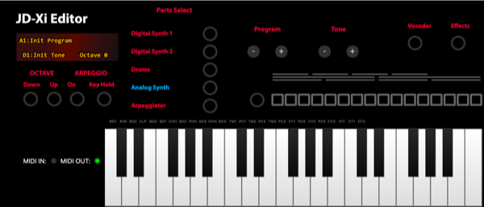

# JDXI-Manager


A Manager for the Roland JD-Xi instrument, written in Python and the Qt Framework and RtMidi 

Designed to implement as many features at possible of the Roland MIDI implementation without menu diving :-)

Not at all feature-complete or even complete, but have a go and let me know your feedback.

<a href="./resources/main_window.png" rel="Current view of the Roland JD-Xi Manager App"> </a>

Current view of the Roland JD-Xi Manager App.


Getting started quick guide:

There are no builds yet, so you'll have to run it from a Python shell.

```code 

    $ git clone https://github.com/markxbrooks/JDXI-Manager.git
    $ cd JDXI-Manager
    $ python -m venv venv
    $ source venv/bin/activate
    $ python -m pip install -r requirements.txt
    $ python -m jdxi_manager.main
```

<a href="./resources/digital_analog_synths.png" rel="Digital & Analog Synths"> </a>

Digital & Analog Synths

<a href="./resources/effects.png" rel="Vocal, Effects and Arpeggiator Windows"></a>

Vocal, Effects and Arpeggiator Windows
