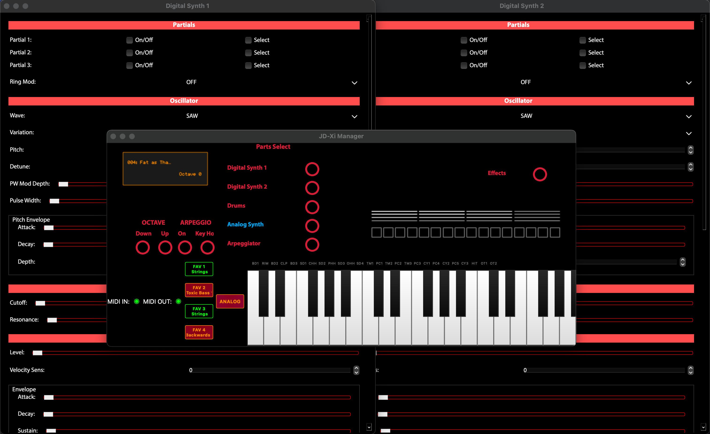

# JDXI-Manager


A Manager for the Roland JD-Xi instrument, written in Python and the Qt Framework 

 

Current view of the Roland JD-Xi Manager App.

Designed to implement as many features at possible of the Roldand MIDI implementation without menu diving :-)

Not at all feature-complete or even complete, but have a go and let me know your feedback.

Getting started:

There are no builds yet, so you'll have to run it from a Python shell.

```code 

    $ git clone https://github.com/markxbrooks/JDXI-Manager.git
    $ cd JDXI-Manager
    $ python -m venv venv
    $ python -r requirements.txt
    $ python -m jdxi_manager.main