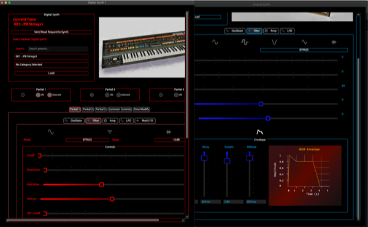

# JDXI-Manager


A Manager for the Roland JD-Xi instrument, written in Python and the Qt Framework and RtMidi 

Designed to implement as many features at possible of the Roland MIDI implementation without menu diving :-)

Not at all feature-complete or even complete, but have a go and let me know your feedback.

<a href="./resources/main_window.png" rel="Current view of the Roland JD-Xi Manager App"> </a>

Current view of the Roland JD-Xi Manager App.


Getting started quick guide:

There are no builds yet, so you'll have to run it from a Python shell.

```code 
    $ git clone https://github.com/markxbrooks/JDXI-Manager.git
    $ cd JDXI-Manager
    $ python -m venv venv
    $ source venv/bin/activate
    $ python -m pip install -r requirements.txt
    $ python -m jdxi_manager.main
```

<a href="./resources/digital_analog_synths.png" rel="Digital & Analog Synths"> </a>

Digital & Analog Synths

&nbsp;

<a href="./resources/effects.png" rel="Effects and Arpeggiator Windows"></a>

Effects and Arpeggiator Windows

&nbsp;

<a href="./resources/vocal_effects.png" rel="Effects and Arpeggiator Windows"></a>

Vocal Effects Window

&nbsp;

<a href="./resources/logs_and_midi.png" rel="Effects and Arpeggiator Windows"></a>

Log Viewer and MIDI Debugger Windows

<a href="./resources/midi_config.png" rel="Effects and Arpeggiator Windows"></a>

MIDI Config Windows

&nbsp;

## Features:

1. Keyboard
2. Preset list selection, including search
3. Octave Key
4. 'LCD' Display
5. Digital Synth Parts 1 & 2, including 3 partials per synth
6. Analog synth
7. Effects: Reverb, Delay, Vocoder
8. Arpeggiator 

### TODO List
1. Drums
2. Sequencer if feasible

## Credits

1) Qt Library
2) RTmidi
3) Cursor.ai
4) qtawesome
5) Various awesome JDXI Manager Programs already existing but somehow could be improved.
6) Roland for a cool little instrument with lots of capability


