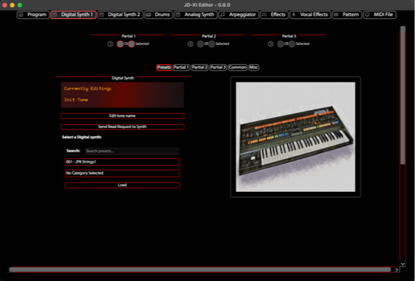

# JDXI-Editor


**JDXI-Editor**: A powerful MIDI editor for the **Roland JD-Xi synthesizer**, built with **Python**, **Qt Framework**, and **RtMidi**. Simplify MIDI editing, preset selection, and sound design without hardware menus. Perfect for musicians and sound designers!

It’s designed to implement as many features as possible from Roland’s MIDI implementation—without the need to dive through hardware menus. 🎛️
> ⚠️ This app is a work in progress and not yet feature-complete—but feel free to try it out and share your feedback!

---

## 🎛️ Features of JDXI-Editor for Roland JD-Xi Synthesizer
- **On-Screen Keyboard**: Easily play and test sounds from your JD-Xi.
- **Preset Selection with Search**: Quickly find and load presets.
- **Octave Shifting**: Adjust octave ranges for precise sound control.
- **Digital & Analog Synth Editors**: Edit JD-Xi's digital and analog synths directly.
- **Drum Part Editor**: Customize drum sounds and patterns 🥁.
- **Effects Editor**: Edit reverb, delay, vocoder, and arpeggiator settings.
- **MIDI Debugger**: Monitor and debug MIDI messages efficiently.

---

Designed for musicians, sound designers, and MIDI enthusiasts looking to unlock the full potential of the Roland JD-Xi synthesizer!

### 🖥️ Current App Preview

<a href="./resources/main_window_0.6.gif" rel="Current view of the Roland JD-Xi Editor App">
  
</a>

---
## 📺 Roland JD-Xi MIDI Editor Video Demo
Watch how **JDXI-Editor** simplifies sound design and MIDI editing for the **Roland JD-Xi synthesizer**:
[](https://www.youtube.com/watch?v=vw-T-9LJkng)


## 🚀 Getting Started


### MacOS 🖥️
There is a new build for MacOS Sequoia. See the [releases page:](https://github.com/markxbrooks/JDXI-Editor/releases/tag/v0.0.8)

### Windows 📦
There is a new build for Windows See the [releases page:](https://github.com/markxbrooks/JDXI-Editor/releases/tag/v0.0.8)

### Python 🐍
If you're a Python , you may wish to run the program from a Python environment:

```bash
$ git clone https://github.com/markxbrooks/JDXI-Editor.git
$ cd JDXI-Editor
$ python -m venv venv
$ source venv/bin/activate
$ python -m pip install -r requirements.txt
$ python -m jdxi_editor.main
```

# 📖 Documentation
Access JD-Xi documentation in the format that works best for you:

## ℹ Available Formats:
### 📃 HTML Documentation:

https://markxbrooks.github.io/JDXI-Editor/

### 📃 PDF Documentation:
Coming soon!
---

### 🎹 UI Previews

**Digital & Analog Synths**  
<a href="./resources/analog_synth.png">
  
</a>

<a href="./resources/digital_synth.png">
  
</a>

&nbsp;

**Midi File Player**  
<a href="./resources/midi_player.png">
  
</a>

&nbsp;

**Pattern Sequencer**  
<a href="./resources/pattern.png">
  
</a>

&nbsp;

**Effects and Arpeggiator**  
<a href="./resources/effects.png">
  
</a>

&nbsp;

**Vocal Effects**  
<a href="./resources/vocal_effects.png">
  
</a>

&nbsp;

**Log Viewer and MIDI Debugger**  
<a href="./resources/logs_and_midi.png">
  
</a>

&nbsp;

**MIDI Configuration**  
<a href="./resources/midi_config.png">
  
</a>

---

## 🎛️ Features

- On-screen Keyboard
- Preset selection with search
- Octave shifting
- JD-Xi-style LCD Display
- ADSR displays
- Pitch ENV displays
- Digital Synth Parts 1 & 2 (including 3 partials per part)
- Analog Synth Editor
- Drum Part Editor 🥁
- Effects: Reverb, Delay, Vocoder
- Arpeggiator Editor

---

## 🧩 Coming Soon

- Pattern Sequencer (one measure is implemented)
- PW Display widget is sorely needed

---

## ❓ Frequently Asked Questions
### What is JDXI-Editor?
JDXI-Editor is a Python-based MIDI editor for the Roland JD-Xi synthesizer, built with the Qt Framework and RtMidi.
### Does JDXI-Editor work on MacOS and Windows?
Yes, JDXI-Editor supports MacOS, and a Windows version is coming soon!
### What features does JDXI-Editor offer?
JDXI-Editor provides preset selection, synth editing, drum part customization, effects editing, and more.

---

- Learn more about the [Roland JD-Xi Synthesizer](https://www.roland.com/global/products/jd-xi/).
- Explore the [Qt Framework](https://www.qt.io/) for building cross-platform apps.
- Discover [RtMidi](https://www.music.mcgill.ca/~gary/rtmidi/), a real-time MIDI library.

---

### 💡 Contribute and Share Feedback
JDXI-Editor is a growing project! 
- ⭐ Star this repository to support its development.
- 🛠️ Contribute features or report issues via [GitHub Issues](https://github.com/markxbrooks/JDXI-Editor/issues).

---

## 🙏 Credits

- [Qt](https://www.qt.io/)
- [RtMidi](https://www.music.mcgill.ca/~gary/rtmidi/)
- [Cursor.ai](https://cursor.so)
- [qtawesome](https://github.com/spyder-ide/qtawesome)
- Inspiration from many great JD-Xi editor projects that paved the way
- **Roland**, for creating such a powerful little synth!

---

> Made with 🎹 and ☕ by @markxbrooks

