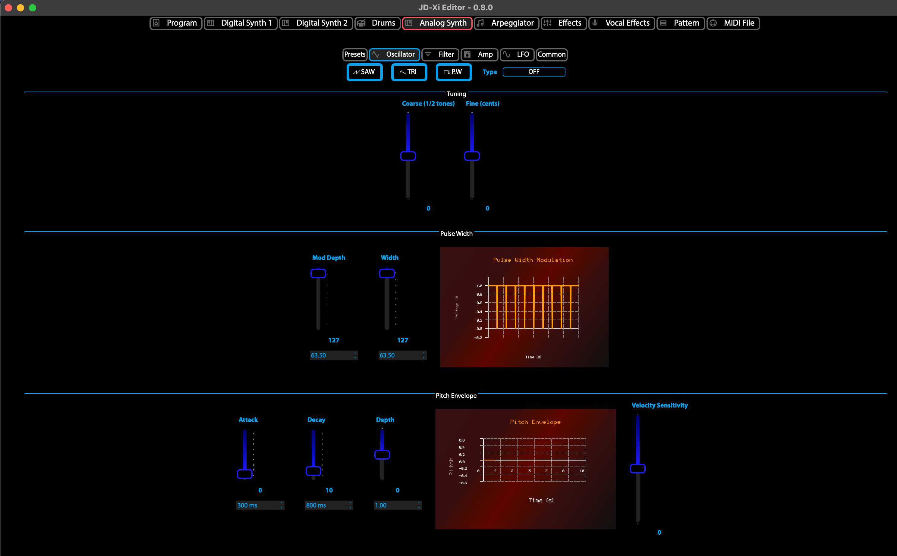

Analog Synth Editor
===================

The **Analog Synth Editor** provides comprehensive control over the JD-Xi's analog synthesis engine, offering classic analog synthesis with modern control capabilities. This powerful editor transforms your JD-Xi's analog synthesis into a professional-grade sound design workstation.

Built with advanced Qt6 technology and featuring real-time parameter control, the Analog Synth Editor serves as your primary workspace for creating, editing, and managing warm, organic analog sounds with the precision and control of modern software synthesizers.

What is the Analog Synth Editor?
================================

The Analog Synth Editor is a specialized interface that provides deep, granular control over the JD-Xi's analog synthesis engine. Unlike the limited hardware interface, this editor offers expansive, visual control over every parameter with real-time feedback, advanced organization tools, and professional-grade editing capabilities.

The editor represents a dedicated workspace optimized for analog sound design, from basic oscillator control to complex analog synthesis. The editor automatically synchronizes with your JD-Xi hardware, ensuring that every change is instantly reflected in your synthesizer's sound.

Core Architecture & Design
===========================

** Traditional Analog Synthesis**
   The Analog Synth Editor features a classic analog synthesis architecture:
   - **Classic Oscillator Control**: Traditional analog oscillator parameters and waveforms
   - **Warm, Organic Sound**: Dedicated analog modeling with vintage character
   - **Performance Controls**: Real-time parameter manipulation for live performance
   - **Timbral Shaping**: Advanced control over harmonic content and character

** Advanced Parameter Management**
   - **Comprehensive Parameter Mapping**: Every analog synth parameter is accessible through intuitive controls
   - **Real-time Updates**: Instant parameter changes with immediate hardware response
   - **Visual Feedback**: Live parameter displays, value indicators, and status monitoring
   - **Preset Integration**: Seamless loading, saving, and management of your custom sounds

** Professional Workflow Tools**
   - **Live Performance Mode**: Optimized interface for real-time performance
   - **Advanced Organization**: Categorize, search, and manage your sound library
   - **Project Integration**: Export and import settings for use in your DAW
   - **Performance Optimization**: Low-latency response for live performance and recording

Analog Synth Editor Features
============================

**Oscillator Control**
   Classic analog oscillator parameters and waveforms:

   **Waveform Selection**
      - **Sawtooth Wave**: Classic analog sawtooth waveform
      - **Square Wave**: Traditional square wave with pulse width control
      - **Triangle Wave**: Smooth triangle waveform
      - **Sine Wave**: Pure sine wave for fundamental tones

   **Oscillator Parameters**
      - **Pitch Control**: Precise pitch adjustment and tuning
      - **Detune Control**: Fine-tuning for detuned effects
      - **Pulse Width**: Square wave pulse width modulation
      - **Waveform Mixing**: Blend between different waveforms

**Filter Control**
   Sophisticated analog-style filtering with resonance and modulation:

   **Filter Types**
      - **Low-Pass Filter**: Traditional analog low-pass filtering
      - **High-Pass Filter**: High-frequency emphasis
      - **Band-Pass Filter**: Frequency band isolation
      - **Multi-Mode Filter**: Switchable filter types

   **Filter Parameters**
      - **Cutoff Frequency**: Real-time cutoff control
      - **Resonance**: Filter emphasis and character
      - **Envelope Modulation**: ADSR control of filter parameters
      - **LFO Modulation**: Low-frequency oscillator modulation

**Envelope Shaping**
   Complete ADSR control with additional envelope stages:

   **ADSR Controls**
      - **Attack**: Initial sound onset control
      - **Decay**: Initial decay after attack
      - **Sustain**: Sustained level control
      - **Release**: Final decay control

   **Additional Envelope Stages**
      - **Hold**: Sustain level holding
      - **Delay**: Pre-attack delay
      - **Additional Decay**: Multi-stage decay
      - **Envelope Scaling**: Time and level scaling

**Effects Integration**
   Built-in effects processing optimized for analog synthesis:

   **Effect Types**
      - **Distortion**: Harmonic enhancement and saturation
      - **Chorus**: Stereo width and movement
      - **Delay**: Time-based effects and echoes
      - **Reverb**: Spatial effects and ambience

   **Effect Parameters**
      - **Real-time Control**: Live parameter manipulation
      - **Effect Routing**: Flexible effect chain routing
      - **Preset Management**: Save and recall effect settings
      - **Performance Integration**: Optimized for live performance

Analog Synthesis Characteristics
===============================

**Warm, Organic Sound**
   Dedicated analog modeling with vintage character:

   **Analog Modeling**
      - **Vintage Character**: Classic analog synthesizer sound
      - **Warmth**: Rich harmonic content and saturation
      - **Organic Feel**: Natural, musical sound characteristics
      - **Vintage Accuracy**: Faithful reproduction of classic analog sounds

   **Harmonic Content**
      - **Rich Harmonics**: Complex harmonic structures
      - **Natural Saturation**: Analog-style harmonic distortion
      - **Warmth Control**: Adjustable warmth and character
      - **Vintage Accuracy**: Faithful reproduction of classic analog sounds

**Performance Controls**
   Real-time parameter manipulation for live performance:

   **Live Performance**
      - **Real-time Updates**: Immediate parameter changes
      - **Smooth Transitions**: Gradual parameter changes
      - **MIDI Control**: External controller integration
      - **Automation**: Parameter automation support

   **Performance Modes**
      - **Live Mode**: Optimized for real-time performance
      - **Edit Mode**: Detailed parameter editing
      - **Preset Mode**: Quick preset switching
      - **Learn Mode**: MIDI controller learning

**Timbral Shaping**
   Advanced control over harmonic content and character:

   **Harmonic Control**
      - **Oscillator Mixing**: Blend between different waveforms
      - **Filter Emphasis**: Control harmonic emphasis
      - **Saturation Control**: Adjust harmonic distortion
      - **Character Shaping**: Fine-tune overall sound character

   **Modulation**
      - **LFO Modulation**: Low-frequency oscillator modulation
      - **Envelope Modulation**: Envelope follower modulation
      - **External Modulation**: MIDI controller modulation
      - **Internal Modulation**: Self-modulation capabilities

Advanced Features
=================

**Real-time Visualization**
   Live display of waveforms, envelopes, and parameter relationships:

   **Waveform Display**
      - **Live Waveforms**: Real-time waveform visualization
      - **Spectrum Analysis**: Frequency domain display
      - **Waveform Comparison**: Compare different waveforms
      - **Custom Waveforms**: Display user-defined waveforms

   **Envelope Visualization**
      - **ADSR Display**: Visual representation of envelope stages
      - **Envelope Editing**: Graphical envelope editing
      - **Envelope Comparison**: Compare different envelopes
      - **Envelope Automation**: Visual automation display

**Preset Management**
   Advanced organization and recall of your custom sounds:

   **Preset Organization**
      - **Categories**: Organize presets by type or style
      - **Tags**: Add custom tags for easy searching
      - **Favorites**: Mark frequently used presets
      - **Recent**: Quick access to recently used presets

   **Preset Operations**
      - **Save**: Save current settings as preset
      - **Load**: Load existing presets
      - **Copy**: Duplicate existing presets
      - **Delete**: Remove unwanted presets

**MIDI Integration**
   Full support for external MIDI controllers and keyboards:

   **Controller Support**
      - **MIDI Learn**: Assign any parameter to any controller
      - **Controller Mapping**: Save and recall controller mappings
      - **Multiple Controllers**: Support for multiple MIDI controllers
      - **Controller Profiles**: Different profiles for different setups

   **Keyboard Integration**
      - **Note Input**: Play notes using MIDI keyboard
      - **Velocity Sensitivity**: Respond to playing dynamics
      - **Aftertouch**: Support for pressure sensitivity
      - **Pitch Bend**: Pitch bend wheel support

Performance Features
====================

**Live Performance Mode**
   Optimized interface for real-time performance:

   **Performance Controls**
      - **Large Controls**: Easy-to-use controls for live performance
      - **Visual Feedback**: Clear indication of current settings
      - **Quick Access**: Fast access to frequently used parameters
      - **Preset Switching**: Quick preset changes during performance

   **Real-time Updates**
      - **Instant Response**: Immediate parameter changes
      - **Smooth Transitions**: Gradual parameter changes
      - **MIDI Control**: External controller integration
      - **Automation**: Parameter automation support

**Parameter Automation**
   Advanced parameter automation capabilities:

   **Automation Types**
      - **LFO Automation**: Low-frequency oscillator automation
      - **Envelope Automation**: Envelope follower automation
      - **External Automation**: MIDI controller automation
      - **Internal Automation**: Self-automation capabilities

   **Automation Control**
      - **Automation Recording**: Record parameter changes
      - **Automation Playback**: Play back recorded automation
      - **Automation Editing**: Edit recorded automation
      - **Automation Management**: Organize and manage automation

Getting Started with Analog Synth Editor
========================================

**Initial Setup**
   1. **Launch Analog Synth Editor**: Open the Analog Synth Editor from the main interface
   2. **Load a Preset**: Start with a factory preset to understand the interface
   3. **Explore Controls**: Familiarize yourself with the available parameters and controls
   4. **Test Your Changes**: Play notes using the virtual keyboard or MIDI controller

**Basic Workflow**
   1. **Choose a Waveform**: Select the basic waveform for your sound
   2. **Adjust Filter**: Set the filter cutoff and resonance
   3. **Shape Envelope**: Adjust the ADSR envelope settings
   4. **Add Effects**: Apply effects to enhance your sound
   5. **Save Your Work**: Use the preset management system to save your creations

**Advanced Techniques**
   - **Waveform Mixing**: Blend different waveforms for complex sounds
   - **Filter Modulation**: Use LFO and envelope to modulate the filter
   - **Envelope Shaping**: Create complex envelope shapes for unique sounds
   - **Performance Integration**: Optimize the interface for live performance

**Tips for Effective Analog Sound Design**
   - **Start Simple**: Begin with basic waveforms and simple envelopes
   - **Use Filter Modulation**: Experiment with filter modulation for movement
   - **Layer Sounds**: Combine multiple analog sounds for richness
   - **Save Frequently**: Save your work regularly to avoid losing changes

The Analog Synth Editor transforms your Roland JD-Xi's analog synthesis capabilities into a professional-grade sound design workstation, providing the tools and interface you need to create, edit, and manage warm, organic analog sounds with the precision and control of modern software synthesizers.

   Analog Synth Editor - Classic Synthesis
