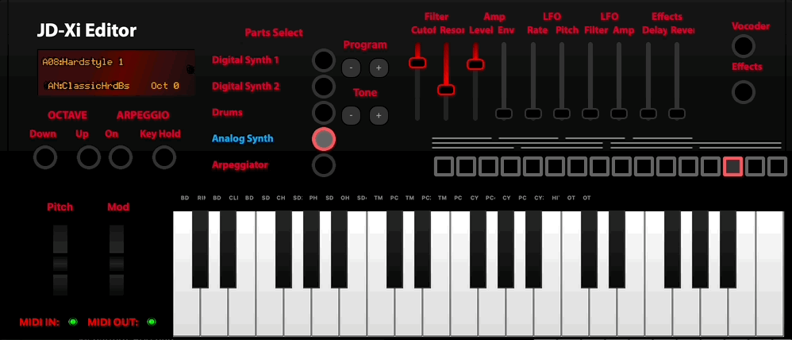

JDXi Instrument Window
======================

The **JDXi Instrument Window** is the central command center of the JDXI-Editor application—a sophisticated, real-time interface that transforms your Roland JD-Xi synthesizer into a powerful, computer-controlled instrument. This window serves as your primary gateway for sound design, performance, and comprehensive control over every aspect of your JD-Xi's capabilities.

   JDXi Instrument Window - Main Interface

What is the JDXi Instrument Window?
===================================

The JDXi Instrument Window is a feature-rich, graphical interface that provides complete real-time control over your Roland JD-Xi synthesizer. Unlike the limited LCD screen and menu-driven interface of the hardware itself, this window offers an expansive, intuitive environment where you can see, control, and modify every parameter with precision and clarity.

Built with modern Qt6 technology, the window features a responsive, professional interface that automatically synchronizes with your JD-Xi hardware, ensuring that every change you make is instantly reflected in your synthesizer's sound.

Core Architecture & Components
==============================

**🎹 Visual Instrument Representation**
   The window displays a high-fidelity, interactive representation of your JD-Xi synthesizer, complete with:
   - **Real-time Status Indicators**: Visual feedback for MIDI communication, preset loading, and parameter changes
   - **Dynamic Part Selection**: Interactive buttons for each synthesizer section (Digital 1, Digital 2, Analog, Drums)
   - **Live Parameter Display**: Real-time visualization of current settings and values
   - **Customizable Layout**: Adaptable interface that scales to your workflow preferences

**🎛️ Comprehensive Control System**
   - **Multi-Part Management**: Simultaneous control over all four synthesizer parts
   - **Real-time Parameter Updates**: Instant synchronization between software and hardware
   - **Bidirectional Communication**: Full read/write capabilities for all JD-Xi parameters
   - **State Management**: Automatic saving and recall of your favorite settings

**🎵 Performance Integration**
   - **On-Screen Piano Keyboard**: Full-featured virtual keyboard for testing and performance
   - **MIDI Controller Support**: Seamless integration with external MIDI controllers
   - **Live Performance Mode**: Optimized for real-time sound design and live performance
   - **Preset Management**: Advanced preset browsing, searching, and organization

Key Features & Capabilities
===========================

**🎹 Complete Synthesizer Control**
   - **Digital Synth Parts 1 & 2**: Full editing capabilities for both digital synthesizer parts, including 3 partials per part
   - **Analog Synth Editor**: Comprehensive control over the analog synthesizer section with real-time parameter updates
   - **Drum Kit Editor**: Customize drum sounds, patterns, and kit parameters with visual feedback
   - **Multi-Part Mixing**: Advanced mixer controls for volume, panning, and routing

**🎛️ Advanced Effects Processing**
   - **Reverb & Delay**: Professional-quality time-based effects with real-time parameter control
   - **Vocal Effects**: Vocoder and voice processing capabilities with live monitoring
   - **Arpeggiator**: Sophisticated pattern generation and sequencing with visual pattern display
   - **Multi-effects Chain**: Layer multiple effects for complex sound design

**🎵 Performance & Workflow Features**
   - **On-Screen Keyboard**: Full 88-key virtual piano with velocity sensitivity and octave shifting
   - **Preset Management**: Advanced search, categorization, and organization of your sound library
   - **Favorites System**: Quick access to your most-used presets and settings
   - **Real-time Monitoring**: Live visualization of MIDI data, parameter changes, and audio levels

**🔧 Professional Tools & Utilities**
   - **MIDI Debugger**: Comprehensive monitoring and troubleshooting of MIDI communication
   - **Parameter Logging**: Detailed tracking of all changes for analysis and recall
   - **Visual Displays**: ADSR envelopes, pitch modulation, and waveform visualization
   - **Cross-Platform Compatibility**: Native performance on macOS, Windows, and Linux

User Interface Components
=========================

**Main Control Panel**
   The central hub featuring:
   - **Part Selection Buttons**: Interactive buttons for Digital 1, Digital 2, Analog, and Drums
   - **Status Indicators**: Real-time MIDI input/output status and connection monitoring
   - **Preset Display**: Current preset information with navigation controls
   - **Quick Access Tools**: Frequently used controls and settings

**Visual Instrument Display**
   A high-resolution representation of your JD-Xi featuring:
   - **Interactive Elements**: Clickable controls that mirror hardware functionality
   - **Real-time Updates**: Live reflection of parameter changes and settings
   - **Customizable Overlays**: Adjustable display elements for different workflow needs
   - **Responsive Design**: Scales beautifully across different screen sizes and resolutions

**Piano Keyboard Interface**
   A professional-grade virtual keyboard providing:
   - **Full 88-Key Range**: Complete piano keyboard with octave shifting capabilities
   - **Velocity Sensitivity**: Realistic key response with adjustable velocity curves
   - **MIDI Controller Integration**: Seamless support for external MIDI controllers
   - **Performance Optimization**: Low-latency response for live performance

**Status Bar & Monitoring**
   Comprehensive system monitoring including:
   - **MIDI Communication Status**: Real-time indicators for input/output connectivity
   - **Parameter Change Logging**: Live feed of all parameter modifications
   - **System Performance**: CPU usage, memory consumption, and response times
   - **Error Reporting**: Automatic detection and reporting of communication issues

Workflow Integration
====================

**Sound Design Workflow**
   1. **Part Selection**: Choose the synthesizer section you want to edit
   2. **Parameter Adjustment**: Use sliders, knobs, and controls to modify settings
   3. **Real-time Testing**: Play notes using the on-screen keyboard or MIDI controller
   4. **Preset Management**: Save your creations and organize your sound library
   5. **Performance**: Use your customized sounds in live performance or recording

**Live Performance Integration**
   - **Instant Access**: Quick switching between presets and settings
   - **Real-time Control**: Immediate response to parameter changes
   - **Visual Feedback**: Clear indication of current settings and changes
   - **Reliable Communication**: Stable MIDI connection for uninterrupted performance

**Studio Workflow**
   - **Precision Editing**: Fine-tune parameters with exact numerical control
   - **Preset Organization**: Advanced categorization and search capabilities
   - **Project Integration**: Seamless workflow with your DAW and recording software
   - **Documentation**: Automatic logging of all changes and settings

Technical Specifications
========================

**System Requirements**
   - **Operating System**: macOS 10.14+, Windows 10+, or Linux (Ubuntu 18.04+)
   - **Python**: Version 3.8 or higher
   - **Memory**: 4GB RAM minimum, 8GB recommended
   - **Storage**: 500MB available space for application and presets
   - **MIDI Interface**: USB connection to Roland JD-Xi synthesizer

**Performance Characteristics**
   - **Latency**: Ultra-low latency MIDI communication (< 5ms)
   - **Refresh Rate**: 60fps real-time parameter updates
   - **Memory Usage**: Optimized for minimal system resource consumption
   - **Stability**: Robust error handling and automatic recovery

**Compatibility**
   - **Hardware**: Roland JD-Xi synthesizer (all firmware versions)
   - **MIDI**: Standard MIDI 1.0 protocol with SysEx support
   - **Controllers**: Full support for MIDI controllers and keyboards
   - **DAW Integration**: Compatible with all major digital audio workstations

Getting Started with the Instrument Window
==========================================

**Initial Setup**
   1. **Connect Your JD-Xi**: Use a USB cable to connect your synthesizer to your computer
   2. **Launch JDXI-Editor**: Start the application and wait for automatic MIDI detection
   3. **Verify Connection**: Check that the MIDI indicators show active input/output
   4. **Load a Preset**: Select a preset to begin exploring the interface

**Basic Operation**
   1. **Select a Part**: Click on Digital 1, Digital 2, Analog, or Drums to choose your target
   2. **Adjust Parameters**: Use the on-screen controls to modify settings in real-time
   3. **Test Your Changes**: Play notes using the virtual keyboard or your MIDI controller
   4. **Save Your Work**: Use the preset management system to save your creations

**Advanced Features**
   - **Multi-Part Editing**: Work with multiple synthesizer parts simultaneously
   - **Preset Management**: Organize and categorize your sound library
   - **MIDI Monitoring**: Use the debugger to troubleshoot and optimize your setup
   - **Custom Workflows**: Adapt the interface to your specific creative process

The JDXi Instrument Window transforms your Roland JD-Xi from a hardware synthesizer into a powerful, computer-integrated instrument that combines the best of both worlds: the tactile feel of hardware with the precision and convenience of modern software interfaces.
