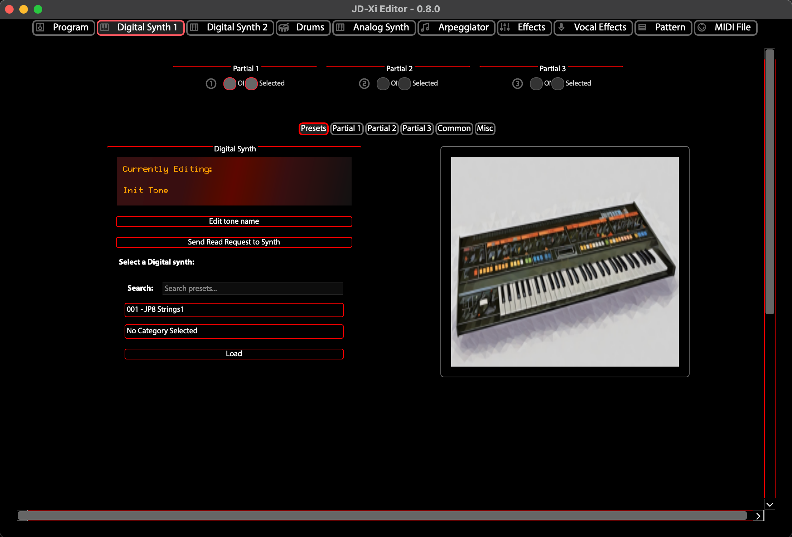
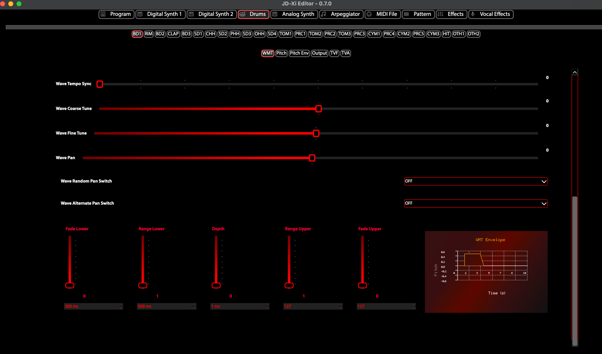
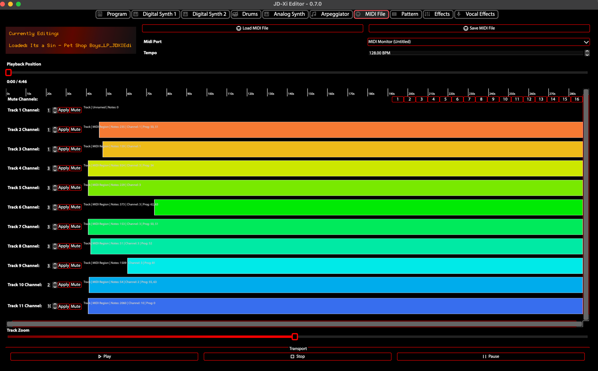

.. jdxi-editor documentation master file, created by
   sphinx-quickstart on Sat May 11 10:48:11 2024.
   You can adapt this file completely to your liking, but it should at least
   contain the root `toctree` directive.

Introduction
============

The JD-Xi Editor is a graphical tool for editing parameters of the JD-Xi instrument, with a focus on ease of use and efficiency, instead of using hardware-based menus.

.. figure:: images/main_window_0.6.gif
   :alt: JD-Xi Instrument Window
   :width: 40%

   Instrument Window

The editor sends and receives MIDI_ commands to control the instrument and determine its state, to display to the user.

.. _MIDI: https://en.wikipedia.org/wiki/MIDI

   Midi logo

There are two main components to the JD-Xi Editor:

1. The JD-Xi Editor Instrument Window, which has sliders, buttons, and a keyboard for sending MIDI messages to the JD-Xi instrument.
- The sliders are linked to (N)RPNS and Control Change parameters of the JD-Xi instrument.
- The buttons are linked to the different MIDI channels of the JD-Xi instrument.
- The keyboard is linked to the different MIDI notes of the JD-Xi instrument.

2. The JD-Xi Editor Window (the main window), which has a tabbed interface for the different JD-Xi "Editors".
- Each Editor tab has sliders, buttons and pull-down menus for the different midi parameters, which apply the changes in real-time via MIDI messages.
- The sliders are linked to the JD-Xi file, so that when the slider is moved, the JD-Xi file is updated.
- For each of the 4 synths, (Digital 1, Digital 2, Analog, Drum Kit), there is a tab in the JD-Xi Editor Window.
- Additional tabs are available for the different JD-Xi parameters, such as Effects, Vocal Effects, which are used to edit the different parameters of the JD-Xi instrument.

- Each Editor tab has sliders, buttons and pull-down menus for the different midi parameters, which apply the changes in real-time via MIDI messages.
- The sliders are linked to the JD-Xi file, so that when the slider is moved, the JD-Xi file is updated.
- For each of the 4 synths, (Digital 1, Digital 2, Analog, Drum Kit), there is a tab in the JD-Xi Editor Window.
- Additional tabs are available for the different JD-Xi parameters, such as Effects, Vocal Effects, which are used to edit the different parameters of the JD-Xi instrument.

   Digital Synth 1

   Drum Kit

   MIDI Editor

