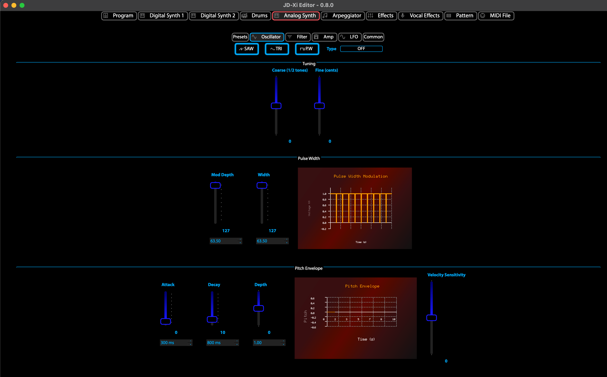

.. jdxi-editor documentation master file, created by
   sphinx-quickstart on Sat May 11 10:48:11 2024.
   You can adapt this file completely to your liking, but it should at least
   contain the root `toctree` directive.

Introduction to the JDXi Editor
===============================

The JDXi Editor is a graphical tool for editing parameters of the JDXi instrument, with a focus on ease of use and efficiency, instead of using hardware-based menus.

There are two main components to the JDXi Editor:

1. The JDXi Editor Instrument Window, which has sliders, buttons, and a keyboard for sending MIDI messages to the JDXi instrument.
- The sliders are linked to (N)RPNS and Control Change parameters of the JDXi instrument.
- The buttons are linked to the different MIDI channels of the JDXi instrument.
- The keyboard is linked to the different MIDI notes of the JDXi instrument.

2. The JDXi Editor Window (the main window), which has a tabbed interface for the different JDXi "Editors".
- Each Editor tab has sliders, buttons and pull-down menus for the different midi parameters, which apply the changes in real-time via MIDI messages.
- The sliders are linked to the JDXi file, so that when the slider is moved, the JDXi file is updated.
- For each of the 4 synths, (Digital 1, Digital 2, Analog, Drum Kit), there is a tab in the JDXi Editor Window.
- Additional tabs are available for the different JDXi parameters, such as Effects, Vocal Effects, which are used to edit the different parameters of the JDXi instrument.

- Each Editor tab has sliders, buttons and pull-down menus for the different midi parameters, which apply the changes in real-time via MIDI messages.
- The sliders are linked to the JDXi file, so that when the slider is moved, the JDXi file is updated.
- For each of the 4 synths, (Digital 1, Digital 2, Analog, Drum Kit), there is a tab in the JDXi Editor Window.
- Additional tabs are available for the different JDXi parameters, such as Effects, Vocal Effects, which are used to edit the different parameters of the JDXi instrument.

   JDXi Editor Window

.. figure:: images/jdxi-digital-synth1.png
   :alt: JDXi Digital Synth 1
   :width: 100%

   JDXi Digital Synth 1

.. figure:: images/jdxi-editor-instrument-window.png
   :alt: JDXi Editor Instrument Window
   :width: 100%

   JDXi Editor Instrument Window

.. figure:: images/jdxi-drum-kit.png
   :alt: JDXi Drum Kit
   :width: 100%

   JDXi Drum Kit

   JDXi Analog Synth

.. figure:: images/jdxi-effects.png
   :alt: JDXi Effects
   :width: 100%   

   JDXi Effects

   JDXi Vocal Effects

   JDXi Pattern Sequencer

.. figure:: images/jdxi-midi-editor.png
   :alt: JDXi MIDI Editor
   :width: 100%   

   JDXi MIDI Editor

.. toctree::
   :maxdepth: 2
   :caption: Contents

   usage
   installation
   api
   troubleshooting
   license