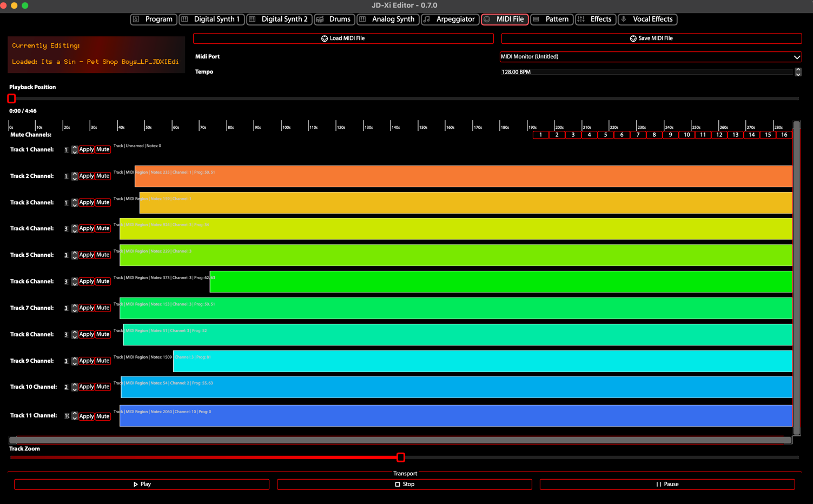

MIDI File Player
================

The **MIDI File Player** provides playback of MIDI files through the Roland JD-Xi or through FluidSynth (SoundFont) when no hardware is connected. It includes track classification, channel assignment, and integration with the Pattern Editor.

What is the MIDI File Player?
==============================

The MIDI File Player loads standard MIDI files (.mid, .midi) and routes tracks to the JD-Xi's four parts: Digital 1 (Ch 1), Digital 2 (Ch 2), Analog (Ch 3), and Drums (Ch 10). You can classify tracks automatically, assign channels, and load the current file into the Pattern Editor for step editing.

Core Features
=============

**MIDI Playback**
   - **Load files**: Open .mid or .midi files via File menu or drag-and-drop
   - **Playback control**: Play, pause, stop, and seek
   - **JD-Xi playback**: Routes MIDI to the connected synthesizer
   - **FluidSynth playback**: When no JD-Xi is connected, uses FluidSynth with a SoundFont (.sf2/.sf3) for software playback

**Track Classification**
   - **Detect Drums**: Identifies drum tracks and assigns them to MIDI Channel 10
   - **Classify Tracks**: Classifies non-drum tracks into Bass (Ch 1), Keys/Guitars (Ch 2), and Strings (Ch 3)
   - **Apply Presets**: Applies channel presets for JD-Xi part routing
   - **Apply All Track Changes**: Applies all track changes (channel assignments, etc.) to the loaded file

**Channel Assignment**
   - Channels 1, 2, 3 map to Digital 1, Digital 2, Analog
   - Channel 10 maps to Drums
   - Drag-and-drop track reordering and channel assignment in the track list

**Pattern Editor Integration**
   - **Load into Pattern Editor**: Loads the current MIDI file into the Pattern Sequencer for step editing

**Format Support**
   - Standard MIDI Files: .mid, .midi
   - MIDI Type 0 and Type 1

SoundFont Playback
==================

When **Enable FluidSynth for local playback** is enabled in MIDI Configuration (and no JD-Xi is connected), the MIDI File Player uses FluidSynth with a configured SoundFont for playback. This allows you to play MIDI files without hardware.

See :doc:`features-and-usage` for SoundFont configuration (path, preset list, etc.).

Workflow
========

1. **Load a MIDI file**: File → Open… or drag-and-drop
2. **Classify tracks** (optional): Use **Detect Drums** and **Classify Tracks** to auto-assign channels
3. **Apply changes**: Use **Apply All Track Changes** or **Apply Presets** to apply channel assignments
4. **Play**: Start playback; audio goes to JD-Xi or FluidSynth
5. **Edit in Pattern Editor** (optional): Use **Load into Pattern Editor** to edit the file in the Pattern Sequencer

   MIDI File Player - Track Classification and Playback
