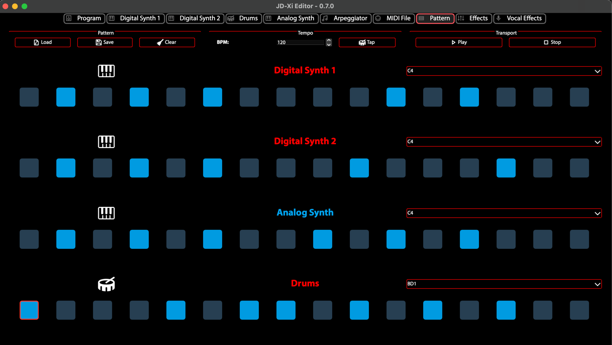

Pattern Sequencer
=================

The **Pattern Sequencer** (Pattern Editor) provides a 4×16 step grid for creating and editing patterns on the Roland JD-Xi. It supports loading and saving MIDI files, part muting, USB recording, and integration with the MIDI File Player.

What is the Pattern Sequencer?
==============================

The Pattern Sequencer is a step-based editor that maps to the JD-Xi's four parts: **Digital 1**, **Digital 2**, **Analog**, and **Drums**. Each part has 16 steps per measure, with support for multiple measures. You can load MIDI files into the grid, edit steps (note, velocity, duration), and save patterns back to MIDI files.

Core Features
=============

**4×16 Step Grid**
   - **Four parts**: Digital 1, Digital 2, Analog, Drums
   - **16 steps per measure**: One step per sixteenth note
   - **Multiple measures**: Add or remove measures as needed
   - **Step editing**: Click steps to add notes; use combo selectors for note assignment (e.g. C4, CLAP for drums)

**MIDI Load and Save**
   - **Load from file**: Use **File → Load MIDI…** or the **Load** button to load a MIDI file into the grid
   - **Load from MIDI File Player**: Use **Load into Pattern Editor** from the MIDI File Player to load the current MIDI file
   - **Save**: Use **File → Save Pattern…** or the **Save** button; the dialog pre-fills with the loaded file path when available
   - **PPQ preservation**: The editor preserves the ticks-per-beat (PPQ) from the loaded file when saving

**Step Editing**
   - **Note**: Assign note or drum name per step (e.g. C4, BD1, CLAP)
   - **Velocity**: Adjust velocity per step
   - **Duration**: Note length per step
   - **Tooltips**: Active notes show note names (C4, CLAP, etc.) in tooltips after load and on edit

**Part Muting**
   - Mute or unmute each of the four parts independently during playback

**USB File Recording**
   - When the JD-Xi is connected, use the USB File Recording widget to record patterns to USB storage

Workflow
========

**Basic workflow**
   1. **Load a MIDI file**: File → Load MIDI… or Load button (or load from MIDI File Player)
   2. **Edit steps**: Click steps to add or change notes; use combo selectors for note assignment
   3. **Save**: File → Save Pattern… or Save button; path pre-fills when loaded from file

**Data consistency**
   - Steps stay in sync with measure data for copy/paste
   - PPQ is synced from the loaded file for correct timing on save

Getting Started
===============

1. **Open the Pattern Sequencer**: Select the Pattern tab from the main interface
2. **Load a pattern**: Use Load or File → Load MIDI… to load a MIDI file
3. **Edit steps**: Click steps to add notes; adjust velocity and duration as needed
4. **Save**: Use Save or File → Save Pattern… to save your work

   Pattern Sequencer - 4×16 Step Grid
