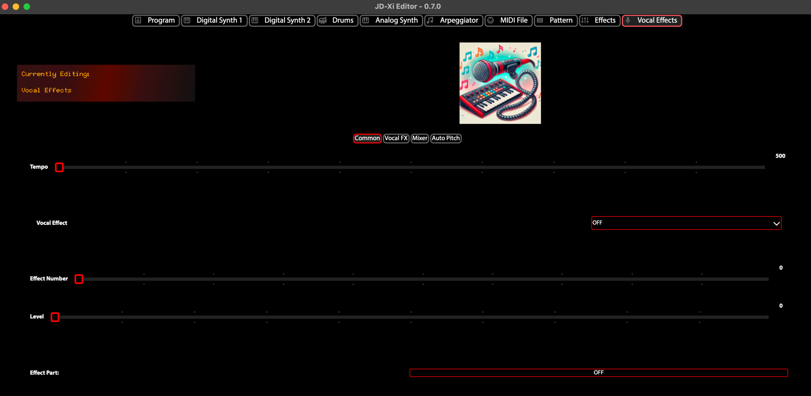

Vocal Effects Editor
====================

The **Vocal Effects Editor** provides control over the Roland JD-Xi's vocal processing: Vocoder and Auto-Pitch. The editor uses a polymorphic UI that switches between OFF, VOCODER, and AUTO-PITCH modes, with three tabs for Common, Vocoder & Auto Pitch, and Mixer parameters.

What is the Vocal Effects Editor?
=================================

The Vocal Effects Editor maps to the JD-Xi's Program Common and Vocal Effect parameters. It requests and receives SysEx data on show, keeping the UI in sync with the hardware. Changes are sent to the synthesizer in real time.

Core Structure
==============

**Effect Type (Polymorphic UI)**
   - **OFF**: Vocal effects disabled
   - **VOCODER**: Classic vocoder processing
   - **AUTO-PITCH**: Auto-pitch correction and processing

   The editor uses a QStackedWidget—selecting an effect type switches the visible page. There is no "Classic Vocoder" vs "Modern Vocoder" distinction; the JD-Xi has these three modes only.

**Tab Layout**
   - **Common**: Shared parameters (e.g. Vocal Effect Part: Part 1 or Part 2)
   - **Vocoder & Auto Pitch**: Parameters specific to Vocoder and Auto-Pitch modes
   - **Mixer**: Mix and balance controls

**SysEx Sync**
   - On show, the editor requests PROGRAM_COMMON and PROGRAM_VOCAL_EFFECT
   - Incoming SysEx updates the controls (COMMON and VOCAL_EFFECT)
   - Parameter addresses: VOCAL_EFFECT 0x16→0x1C (per JD-Xi guide)

Key Parameters
=============

**Common**
   - **Vocal Effect Part**: Part 1 or Part 2 (which synth part feeds the vocal effect)

**Vocoder & Auto Pitch**
   - Parameters vary by effect type; see the JD-Xi manual for full parameter list

**Mixer**
   - **Balance [dry→wet]**: Balance between dry and processed signal
   - **Pan**, **Gender**, **Octave**: Additional controls as supported by the JD-Xi

Getting Started
===============

1. **Open the Vocal Effects Editor**: Select the Vocal Effects tab in the Program Editor
2. **Choose effect type**: Select OFF, VOCODER, or AUTO-PITCH from the effect type combo
3. **Adjust parameters**: Use the Common, Vocoder & Auto Pitch, and Mixer tabs
4. **Save**: Use File → Save Patch to save your program (Vocal Effects are included in patch save)

   Vocal Effects Editor - OFF/VOCODER/AUTO-PITCH
